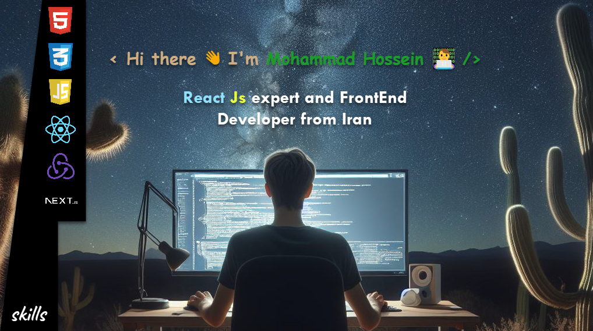

<p align="center"></p>

# <p align="center">∞ Welcome To My Account ∞</p>
```javascript
const my = {
                                                                               ///My Account
  Account: [

    {
      firstName: "Mohhamad Hossein                     ",
      lastName:  "Khadem al - Mahdi                    ",
      field:     "FrontEnd Web Developer               ",
      bio:       "Hi there 👋 I'm Mohammad Hossein 👨‍💻 ",
      interest:  "95%                                  ",
    }

  ],
                                                                               ///My Languages
  Languages: [

    {lang: 'Html       ', learn: '90%'},
    {lang: 'Css        ', learn: '85%'},
    {lang: 'Regex      ', learn: '70%'},
    {lang: 'JavaScript ', learn: '90%'},
    {lang: 'React Js   ', learn: '80%'},
    {lang: 'Redux      ', learn: '85%'},
    {lang: 'Next Js    ', learn: '...'},

  ],
                                                                               ///My Location
  Location: [

    {
      continent: 'Asia    ',
      country:   'Iran    ',
      city:      'Mashhad ',
    }

  ]


}
```


<p align="center"> </p>
<p align="center"></p>


<!--
**khadem-mh/khadem-mh** is a ✨ _special_ ✨ repository because its `README.md` (this file) appears on your GitHub profile.

Here are some ideas to get you started:

>### Languages
>> 
>> 
>> 
>> 
>> 

>### Packages
>> 

- 🔭 I’m currently working on ...
- 🌱 I’m currently learning ...
- 👯 I’m looking to collaborate on ...
- 🤔 I’m looking for help with ...
- 💬 Ask me about ...
- 📫 How to reach me: ...
- 😄 Pronouns: ...
- ⚡ Fun fact: ...
-->

>### My Social Network
>
> [](https://www.linkedin.com/in/khadem-mh)
> [](https://github.com/khadem-mh)
> [](https://pinterest.com/khadem_mh)
> [](https://web.telegram.org/k/#6411851503)
> [](https://wa.me/989031335939)
> [](https://wakatime.com/@khadem_mh)
